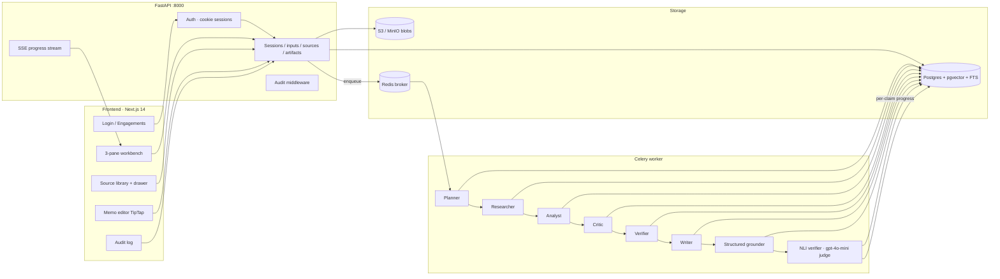

# Argus — Evidence-Grounded AI Decision Engine

A multi-tenant AI workbench for consulting firms that turns strategic questions, uploaded documents, and web evidence into client-ready deliverables — every claim grounded in a specific chunk of a real source, every citation NLI-verified for entailment, and every downstream artifact (memo, deck) bound to that evidence trail.

---

## Demo

- **Live demo:** _<link — coming soon>_
- **3-minute walkthrough:** _<Loom link — coming soon>_
- **Example use case:** *"Should a SaaS company enter Germany or France first?"*
- **Full case study:** [`docs/case-studies/germany-vs-france/`](docs/case-studies/germany-vs-france/)

> Want to try it without an API key? Run `make demo` and Argus boots with a pre-seeded firm, three demo engagements, a demo user (`demo@argus.local` / `demo-password`), and a finished example report. See **Quickstart** below.


---

## The problem

Generic chatbots produce fluent prose that quietly mixes inference with facts and cites nothing you can audit. Consultants are slow and expensive. Spreadsheets and decks don't synthesize across documents and the open web — search gives fragments, chat gives opinions.

Argus produces a **defensible recommendation**: every claim cites a specific chunk (page, slide, timestamp, or section heading) of a specific source, an LLM-judge NLI pass marks each citation as `Supported / Weak / Unsupported`, contradictions cap the overall confidence, and the deliverable exports as a footnoted DOCX.

---

## What's different

| Most AI tools | Argus |
|---|---|
| One model, one shot | 6-agent pipeline (planner → researcher → analyst → critic → verifier → writer), each persisted with token + duration metrics |
| "Cite source" = source-level URL | Citations bind to specific **chunks** with page / slide / `00:12:34 — Sarah Chen` / section heading |
| Single retrieval method | Hybrid retrieval (pgvector + Postgres FTS) fused via Reciprocal Rank Fusion (RRF, k=60) |
| Trust = vibes | 4-tier explicit trust model (firm-vetted / credible-external / web-general / contested) per source, color-coded everywhere |
| Hidden inference | Every claim NLI-checked per cited chunk via gpt-4o-mini judge; results stream in live, contradictions visibly downgrade confidence |
| One-user, one-tenant | Engagement memberships (lead / member / viewer), firm-scoped library, append-only audit log |

---

## Architecture



| Layer | Tech |
|-------|------|
| Frontend | **Next.js 14** App Router · Tailwind · TypeScript · **TipTap** (artifact editor) |
| API | **FastAPI** (Python 3.11+) · async · slowapi rate limiting · SSE |
| Auth | bcrypt + opaque-token cookies (HTTP-only · SameSite=Lax) · engagement-scoped permissions |
| Worker | **Celery 5.3** + **Redis 7** broker/result store |
| Database | **PostgreSQL 15** + **pgvector** (1536-dim) + **FTS** (tsvector/GIN) |
| Object storage | **S3 / MinIO** for original blobs (split internal/public endpoints for signed URLs) |
| LLM stack | **LiteLLM** multi-provider abstraction · **Instructor** typed structured outputs · OpenAI gpt-4o + gpt-4o-mini · optional SerpAPI, Cohere rerank |
| Pipeline | Planner → Researcher → Analyst ↔ Critic → Verifier → Writer → Structured grounder → NLI verifier |
| Exports | **DOCX** with footnoted citations (python-docx walks ProseMirror) · WeasyPrint PDF · python-pptx deck · structured JSON |

Deep architecture: [`docs/architecture.md`](docs/architecture.md).

---

## Features

| Feature | What it does |
|---------|--------------|
| **3-pane workbench** | Bloomberg/Palantir-style layout: source rail (280px) · conversation (flex) · artifacts rail (340px), framed for a forward-deployed analyst |
| **Email/password auth** | bcrypt + opaque-token sessions in HTTP-only cookies; demo user pre-seeded |
| **Engagement memberships** | `lead` / `member` / `viewer` roles per engagement; permission-aware retrieval and write paths |
| **Chunk-grounded citations** | Every `[N]` binds to a specific chunk; hover shows page / slide / `00:12:34 — Sarah Chen` / section heading |
| **NLI citation verification** | gpt-4o-mini LLM-judge checks `claim ⊨ chunk`; per-claim results stream in (`Verifying… → Supported / Weak / Unsupported`); contradictions visibly downgrade confidence |
| **Hybrid retrieval** | pgvector + Postgres FTS fused via RRF (k=60), permission-filtered before fusion |
| **4-tier trust model** | Firm-vetted (green) · credible-external (blue) · web-general (amber) · contested (red); color-coded on every citation, source row, and pill |
| **Source library** | Firm-wide knowledge: search, trust + file-type filter chips, click-through detail drawer, scope toggle (engagement → firm-wide) |
| **Drag/drop ingest** | Multi-file upload (PDF/CSV/JSON), URL paste, scope toggle, trust-tier picker; per-job phase indicator (`Queued → Uploading → Submitted → Tagging → Done`) |
| **Memo editor** | TipTap-based artifact editor: outline rail, slash menu (`/heading`, `/bullet`, `/quote`, `/citation`), citation footer, status pill (draft / review / final) |
| **DOCX export with footnotes** | python-docx walks the ProseMirror tree, emits superscript citations + sources appendix |
| **Audit log** | Append-only `audit_events` table; admin page renders rows in plain language ("Demo User uploaded test-source.csv (firm vetted)") with day grouping and kind chips |
| **Golden eval harness** | Citation faithfulness + banned-phrase regression scoring against canned cases in `backend/eval/golden/` |
| **One-command demo** | `make demo` brings up the whole stack with a seeded firm, demo user, three engagements, and a finished example report |

---

## Quickstart

### One-command demo (no API key required)

```bash
git clone https://github.com/yassin1123/Argus.git
cd Argus
make demo
```

Open [http://localhost:3000](http://localhost:3000). Sign in as `demo@argus.local` / `demo-password`. The homepage will already have three seeded demo engagements you can click into immediately.

### Full mode (with your own API key)

```bash
cp .env.example .env
# Set OPENAI_API_KEY in .env
# Optional: SERPAPI_KEY, COHERE_API_KEY for web search and rerank

docker compose up --build
```

Frontend (second terminal):
```bash
cd frontend
cp ../.env.example .env.local   # NEXT_PUBLIC_API_URL=http://localhost:8000
npm install && npm run dev
```

Open [http://localhost:3000](http://localhost:3000). Health check: [http://localhost:8000/api/health](http://localhost:8000/api/health). MinIO console: [http://localhost:9001](http://localhost:9001).

> Postgres init applies SQL in `backend/db/migrations/` (`001` … `021`). Reusing an old volume? `docker compose down -v` first. See [`ZIP_PACKAGE.md` §5](ZIP_PACKAGE.md).

> **Auth bypass for local development:** Set `ARGUS_AUTH_BYPASS=1` on the backend to attach all requests to the seeded demo user (useful for curl / smoke tests). This is *not* the same as `DEMO_MODE` — bypass is permissions-only.

Optional smoke check after Compose is up:
```bash
bash tools/smoke_check.sh
```

---

## The pipeline

| Agent | Responsibility | Output |
|-------|----------------|--------|
| **Planner** | Breaks the strategic question into 4–8 research tasks with decision criteria and scope | `tasks[]`, `decision_criteria[]`, `scope` |
| **Researcher** | Executes tasks in parallel; pulls from documents (chunked, embedded) and the web; deduplicates and triages | `EvidenceObject[]` (UUID, quote, source, confidence, is_inference) |
| **Analyst** | Synthesizes ≥6 key claims, each tied to evidence UUIDs; produces recommendation, trade-offs, assumptions | `key_claims[]`, `recommendation`, `trade_offs`, `assumptions` |
| **Critic** | Challenges the analysis; flags weak points; issues revision instructions with severity | `verdict`, `revision_instructions[]` |
| **Analyst (revision)** | Applies critic feedback; re-synthesizes | revised `key_claims[]` |
| **Verifier** | Re-checks every analyst claim against the evidence catalog | `claim_assessments[]` (verdict + evidence_ids + notes) |
| **Writer** | Produces the consulting-grade report; **must** link `executive_insights`, `recommendation_claim_ids`, `key_risks_structured` to analyst claim_ids (enforced) | `WriterReportPayload` |
| **Structured grounder** | (Phase 7) Re-ground writer output into `StructuredAnswer` where every claim references real chunk UUIDs from the chunks table — invalid IDs dropped or downgraded | `StructuredAnswer` (sections × claims × chunk_ids) |
| **NLI verifier** | (Phase 8) Per-(claim, chunk) entailment via gpt-4o-mini LLM judge; persists progress per claim so the UI streams `Verifying… → Supported / Weak / Unsupported`; contradictions downgrade `confidence` to `contested` | `NliResult[]` per claim, `verification_state: pending / verifying / complete` |

**Evidence gates** ensure every key claim cites a real persisted evidence object — strict mode bans inference-only support. **Contradiction policy** caps confidence when sources disagree. **Citation faithfulness** is verified at two layers: structurally (chunk_ids must exist) and semantically (NLI judge entailment).

---

## API surface

### Auth + sessions
| Method | Path | Purpose |
|--------|------|---------|
| `POST` | `/api/auth/register` · `/api/auth/login` · `/api/auth/logout` | Email/password auth |
| `GET` | `/api/auth/me` | Current user |
| `GET` `POST` | `/api/sessions` | List / create engagements |
| `POST` | `/api/sessions/{id}/intake/generate` · `/api/sessions/{id}/intake/submit` | Intake flow |
| `POST` | `/api/sessions/{id}/run` | Enqueue the pipeline |
| `GET` | `/api/sessions/{id}` · `/api/sessions/{id}/chat` | Detail + conversational follow-ups |

### Workspace + evidence
| Method | Path | Purpose |
|--------|------|---------|
| `GET` | `/api/workspaces/{id}` | Session detail + presentation labels (primary UI feed) |
| `GET` | `/api/workspaces/{id}/events` | SSE progress stream |
| `GET` | `/api/workspaces/{id}/graph` | Normalized evidence graph (claims ↔ evidence ↔ sources) |

### Sources, library, ingest
| Method | Path | Purpose |
|--------|------|---------|
| `POST` | `/api/inputs/upload` · `/api/inputs/url` | Document ingest (PDF/CSV/JSON, fetched URL) |
| `GET` `PATCH` `DELETE` | `/api/sources/{id}` | Source CRUD; PATCH supports `trust_level`, `scope`, `notes`, `title` |
| `GET` | `/api/sources?engagement_id=…` | Engagement source list |
| `GET` | `/api/sources/search?engagement_id=…&q=…&mode=hybrid` | Hybrid chunk search (RRF) |
| `GET` | `/api/library/sources` | Firm-wide library (scope=firm) |

### Engagements + memberships
| Method | Path | Purpose |
|--------|------|---------|
| `GET` `POST` `DELETE` | `/api/engagements/{id}/members` | Lead/member/viewer membership management |

### Artifacts + exports
| Method | Path | Purpose |
|--------|------|---------|
| `POST` `GET` `PATCH` `DELETE` | `/api/artifacts` · `/api/artifacts/{id}` | Memo / deck / model / chart artifacts (TipTap document_json) |
| `GET` | `/api/artifacts/{id}/export?format=docx` | DOCX with footnoted citations + sources appendix |
| `GET` | `/api/exports/pdf\|memo\|report\|pptx/{id}` | Legacy report deliverables (content-hash cached) |

### Admin
| Method | Path | Purpose |
|--------|------|---------|
| `GET` | `/api/admin/audit?engagement_id=…&limit=…` | Append-only audit log (lead-only on engagement view; firm admin globally) |

---

## Engineering quality

- **Multi-tenant from day one** — users + sessions_auth + engagement_memberships in core schema; permission resolver (`can_read / can_write / can_admin`) gates every read and write path.
- **Auditable by construction** — `audit_events` is append-only, written by FastAPI middleware on every request that mutates state; admin page humanizes rows.
- **LLM-cost-tracked** — `llm_calls` table logs provider, model, tokens (in/out), latency, and cost per call; queryable per session.
- **Typed structured outputs** — Instructor wraps every LLM call that returns structured data; chunk_id validation pass drops invalid references before they hit the database.
- **Streaming verification** — NLI verifier writes `verification_state` (`pending → verifying → complete`) and per-claim `nli_results` incrementally; the workspace polls until `complete`, citations transition from pulsing spinner to final state in real time.
- **Strict evidence gates** — analyst claims must cite catalog UUIDs; writer must link insights to claim_ids; structured grounder must cite real chunk UUIDs; all enforced and tested.
- **Golden eval harness** — `backend/eval/harness.py` scores citation faithfulness + banned-phrase regression against canned cases (`backend/eval/golden/`).
- **Dockerized local environment** — one command runs Postgres + pgvector, Redis, MinIO, FastAPI, Celery worker, and the Next.js dev server.
- **CI checks** — backend tests + type checks + frontend `tsc --noEmit` + Docker Compose demo smoke test.

---

## Why this matters for deployment

Argus is built around the realities of forward-deployed AI work: ambiguous client problems, messy evidence, the need for auditable reasoning, fast iteration, and a polished deliverable a client can actually take to a meeting. The architecture treats **chunk-level provenance**, **multi-tenant permissions**, **streaming verification**, **explicit trust tiers**, and **exportable artifacts** as first-class concerns — not as bolt-ons.

For the bridge between this portfolio demo and a real engagement — multi-region tenancy, SSO, fine-grained audit retention, eval harness expansion, tracing, cost transparency, and what I'd *deliberately defer* — see [`docs/day-one.md`](docs/day-one.md).

---

## Tests

```bash
make test
# or:
cd backend && pip install -r requirements.txt && pytest tests -q
```

Golden eval (citation faithfulness + banned-phrase regression):
```bash
cd backend && python -m eval.harness
```

Frontend type check:
```bash
cd frontend && npx tsc --noEmit
```

CI runs the same suite plus a Docker Compose demo smoke test on every push.

---

## Repository layout

| Path | What lives there |
|------|------------------|
| [`backend/api/`](backend/api/) | HTTP routers — sessions, workspaces, sources, artifacts, engagements, auth, admin/audit, exports |
| [`backend/auth/`](backend/auth/) | `get_current_user`, password hashing, opaque-token sessions, permission resolver |
| [`backend/agents/`](backend/agents/) | Pipeline agents — `orchestrator.py` is the entry point; `nli_verifier.py` is the streaming Phase 8 judge |
| [`backend/core/`](backend/core/) | Evidence gates, retrieval (`retrieval_chunks.py` with RRF), verification, contradiction policy, trust labels |
| [`backend/core/inference/`](backend/core/inference/) | LiteLLM wrapper + cost tracking + Instructor integration |
| [`backend/ingest/`](backend/ingest/) | Section-aware chunkers (PDF / transcript / web) + ingest pipeline |
| [`backend/storage/`](backend/storage/) | S3/MinIO blob storage + chunk DB queries |
| [`backend/audit/`](backend/audit/) | FastAPI middleware writing `audit_events` |
| [`backend/eval/`](backend/eval/) | Golden eval harness + canned cases |
| [`backend/db/migrations/`](backend/db/migrations/) | SQL migrations (`001` … `021`) |
| [`backend/deliverables/`](backend/deliverables/) | DOCX (python-docx walking ProseMirror), PDF, PPTX, memo rendering |
| [`backend/models/`](backend/models/) | Pydantic models — `structured_answer.py` carries `verification_state` |
| [`backend/tests/`](backend/tests/) | pytest suite + fixtures |
| [`frontend/app/`](frontend/app/) | Next.js App Router pages — `(auth)/`, `sessions/[id]/`, `library/`, `admin/audit/`, `settings/` |
| [`frontend/components/shell/`](frontend/components/shell/) | `AppShell` (with `ToastProvider`), nav rail, account menu |
| [`frontend/components/workspace/`](frontend/components/workspace/) | 3-pane workbench: `Conversation`, `SourceRail`, `ArtifactsRail`, `MemoEditor`, `AddSourcePanel`, `CaveatBanner`, `citation.tsx` |
| [`frontend/components/library/`](frontend/components/library/) | Source library detail drawer |
| [`frontend/components/ui/`](frontend/components/ui/) | Shared `StatusPill`, `Toast`, `EmptyState`, `Badge`, `Skeleton`, `Button`, `Card`, `Chip`, `Surface` |
| [`docs/case-studies/`](docs/case-studies/) | Worked examples with full inputs, outputs, deliverables |
| [`docs/architecture.md`](docs/architecture.md) | Deep architecture + data flow |
| [`tools/`](tools/) | Build, smoke check, e2e scripts |

For commands and curl samples, also see [`ZIP_PACKAGE.md`](ZIP_PACKAGE.md). For codebase change-points, [`CODEBASE_OVERVIEW.md`](CODEBASE_OVERVIEW.md).
