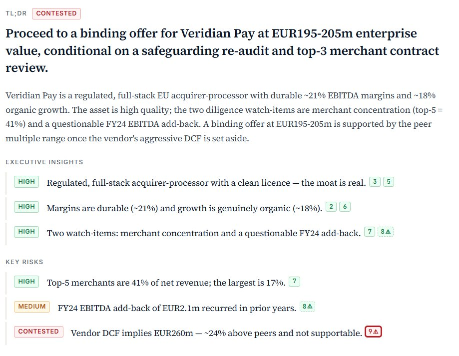
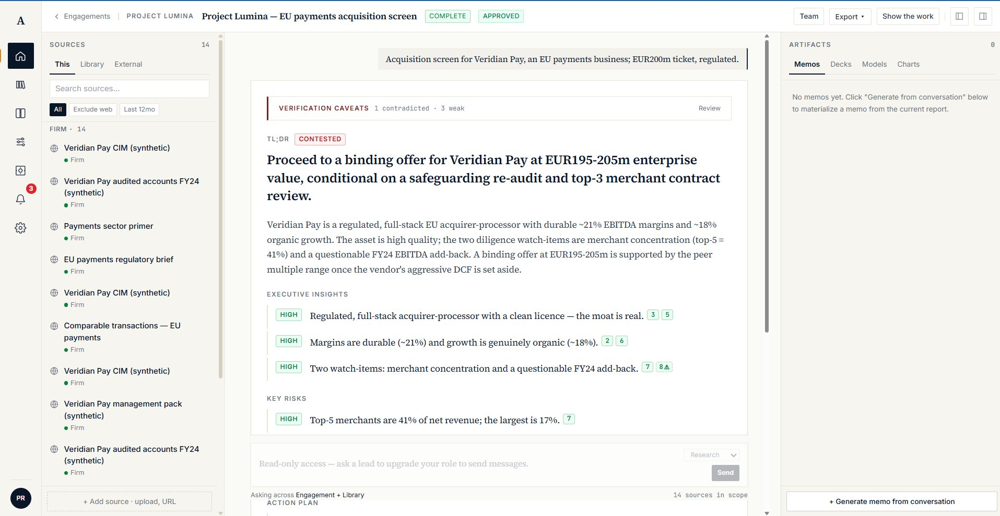
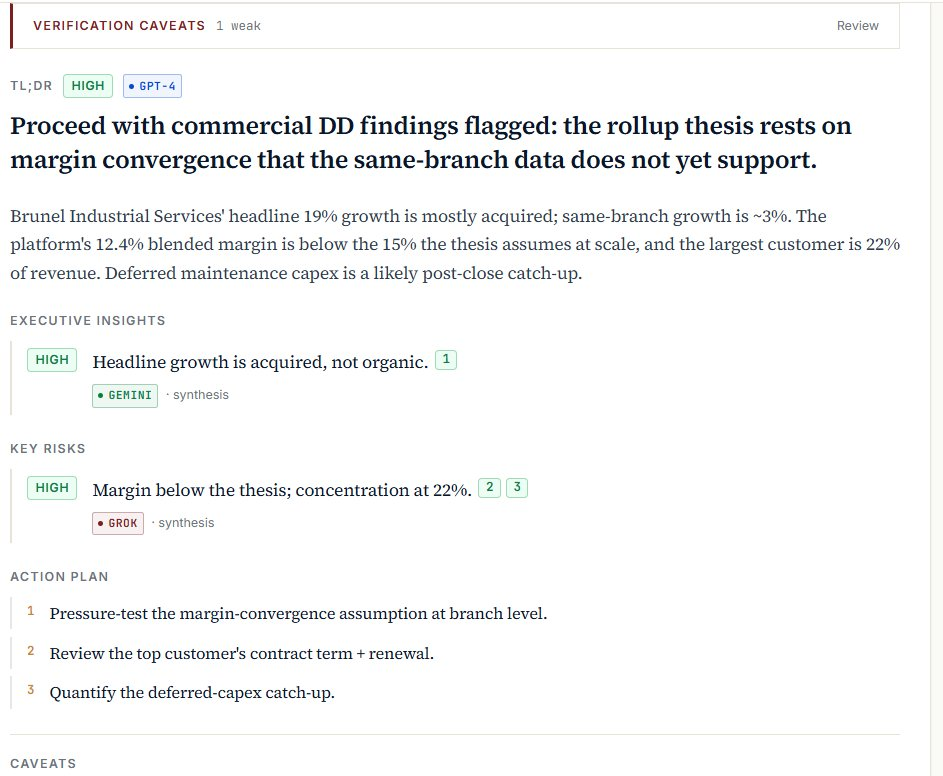
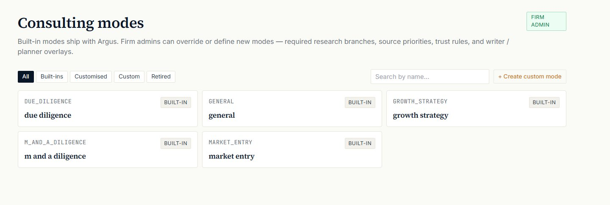

<div align="center">


# Argus

### Every claim, sourced. Every memo, verified by a model that didn't write it.

**Verification-grounded research and deliverables for boutique consulting firms.**

[](https://github.com/yassin1123/Argus/releases)
[](#deployment-status)
[](#the-verification-spine)
[](#the-verification-spine)

</div>

---

<div align="center">



<sub><i>A real engagement memo. Every claim carries a citation and a verification verdict — and the system refuses to back the one claim the evidence doesn't support.</i></sub>

</div>

---

Argus is the consulting platform where **every claim in every deliverable links back to its source**, every memo is checked by a model from a **different AI provider family** than the one that wrote it, and your firm's own playbooks shape the output.

Built for **boutique consulting firms** — 10 to 100 consultants — who win on quality and senior judgment, not headcount. A consultant types a brief; minutes later the firm has a verified claim base that renders into six client-ready deliverables, each one source-traceable and reviewed by a partner before it ever reaches a client.

**Deployed to ~150 users at 180 Degrees Consulting (University of Southampton)**, where it was built and put into live use — and in talks to expand to other 180 Degrees branches and to **Blackmont Consulting**.

> **The honest version of v1.0.** Argus is at v1.0 because **a real firm uses it** — not because every feature is built. The verification layer is **GREEN-gated but deliberately conservative**. Several enterprise features are explicitly deferred to post-1.0 (named below, not hidden). Real-world use is *underway*; whether it's a *measured success* is the [retro framework](docs/pilot/retro_framework.md)'s call, not this README's.

---

## Why this exists

AI writes confident, fluent, plausible analysis. The problem isn't fluency — it's that a partner's name goes on the deliverable, and a single fabricated number ends a client relationship. Existing tools ask a firm to *trust* the output. Argus is built so a firm never has to: it makes every claim **falsifiable, sourced, and cross-checked**, and it makes a hallucination something the system is structurally biased to *catch* rather than to *emit*.

That's the wedge. Everything below serves it.

---

## What a consultant gets

A consultant types a brief — *"M&A target screen for an EU payments business, €200M ticket, regulated."* Intake clarifies scope. Minutes later, one verified claim base renders into **six deliverables**:

| Deliverable | Format | What it is |
|---|---|---|
| **Sourced memo** | HTML / PDF | The analysis, every claim citation-linked and verification-rated |
| **Executive 1-pager** | HTML / PDF | The recommendation, distilled to a single page |
| **Consulting deck** | PPTX | Mode-aware structure, firm-branded, framework visuals |
| **Financial model** | XLSX | Cross-sheet formulas, citation comments on every payload-derived cell |
| **Client cover email** | MD / HTML / PDF | Attachment-aware, partner-ready |
| **Expert interview guide** | MD / HTML / PDF | A 45-min call targeting the analysis's own evidence gaps |

<div align="center">

<sub><i>One engagement workspace: firm sources on the left, the verified memo in the centre, deliverables on the right.</i></sub>
</div>

Every factual claim across all six traces back to a specific source passage. Every claim was checked by a model from a different provider family than the one that wrote it. The consultant reviews claim by claim; the senior approves the diff; only an approved engagement exports with the *client-ready* watermark.

---

## The verification spine

*This is the part that matters. The honest, measured version.*

<div align="center">

<sub><i>Claims carry the model family that produced them. The judge is from a different family than the writer — visible, not asserted.</i></sub>
</div>

**Cross-family verification, enforced at boot.** The model that writes a claim is never the model that verifies it (Anthropic synthesis × an OpenAI `gpt-4o` judge). Same-family verification is theatre — models share biases and ratify each other's hallucinations. Argus **refuses to start in production** if it can't run the real cross-family verifier. There is no silent fallback to a weaker checker — ever.

**A three-signal NLI ensemble.** An LLM judge, a DeBERTa-v3 cross-encoder running locally, and a numeric / named-entity overlap detector. The aggregator can only ever *downgrade* a verdict — it moves "supported" to "weak" or "contradicted," never the other way.

**The measured guarantee.** On **61 human-labelled real engagement claims**, scored through the real cross-family verifier:

| Metric | Result |
|---|---|
| **False positives on "supported"** | **0%** — every claim it marked verified, was |
| **Recall on insufficient** (catch rate) | **100%** — it missed no unsupported claim |
| Recall on supported | ~27% (deliberately conservative — see below) |
| Gate verdict | **GREEN** |

**The posture is "verified (conservative)," not "perfectly verified" — and that's a design choice.** When Argus marks a claim *supported*, on the real-claim set it was right every time. The trade-off is caution: it **over-flags**, routing many genuinely-fine claims to "needs review" rather than risk one wrong "supported." A human clears the flagged ones before a client sees anything. For a product whose entire value is trust, erring toward "make the human double-check" beats erring toward "ship the hallucination." Reducing the over-flagging *without* raising the false-positive rate is the headline post-1.0 work.

> A memo where every claim is green is a memo that isn't really checking. Argus shows its caveats — *"1 contradicted · 3 weak"* — because that's what honest verification looks like.

---

## Real sources, not synthetic summaries

Argus grounds claims in citable primary sources:

- **SEC EDGAR** — 10-K, 10-Q, 8-K, DEF 14A, S-1. Item-aware chunking; citations link to the exact passage.
- **Companies House** — UK accounts, filing history, officers, charges. *(Scanned image-only filings need OCR — post-1.0.)*
- **Earnings-call transcripts** — speaker-turn-aware.
- **Structured news** — recency- and authority-ranked.
- **Your firm's content** — playbooks, sector primers, prior reports, frameworks. Firm-scoped, retrievable across every engagement at that firm, **never crossing a firm boundary**.

Every source is chunked, embedded, NLI-verified, and trust-scored before it can ground a single claim.

---

## Your firm, in the system

- **Firm knowledge layer.** Upload your sector primers, valuation playbooks, prior reports, frameworks — first-class retrieval sources for every engagement at your firm, never leaking across firms.
- **Layered consulting modes.** Built-in modes (general, market entry, due diligence, growth strategy, M&A diligence) with per-firm and per-engagement overrides.
- **Structured frameworks.** Pyramid + MECE checks; 2×2, Porter's Five Forces, Value Chain — rendered from verified claims, not decoration.
- **Your branding.** Logo, colours, and footer in every PDF, deck, 1-pager, and email.

<div align="center">

<sub><i>Built-in modes ship with Argus; firm admins override them or define custom modes — required research branches, source priorities, trust rules, writer overlays.</i></sub>
</div>

---

## Built for teams, with accountability

- **Manager review workflow.** `draft → in_review → changes_requested → approved → delivered`. Role-gated, structured feedback, segregation of duties (the reviewer is never the author), lock-on-approval with audited auto-revert.
- **Inline comments** anchored to a section, a claim, an artifact, or a text range — claim-anchored threads survive memo edits. `@`-mentions, resolve/unresolve, orphan detection.
- **Ownership + tasks.** Per-section ownership and work-status, a derived task queue spanning every engagement an owner touches.
- **Notifications.** In-app feed + email, with actor-exclusion and dedup so you're never spammed about your own actions.
- **Version history.** Every payload-changing action appends an immutable version. Diff any two (per-section and word-level) and restore (approval-aware).

---

## Observability & enterprise

**Observability (in-house).** Structured logs with trace correlation, per-endpoint and per-LLM-call metrics, a cost ledger, full request-lifecycle trace assembly, an admin dashboard, and a live-pilot watch view with operator alerting (engagement failure, error-rate spike, budget threshold, anomalous verification distribution). No client prose ever enters a log, metric, or trace.

**The four enterprise pillars.**

| Pillar | What it guarantees |
|---|---|
| **Tenant isolation** | Centralised access guard; cross-firm requests return 404 (anti-enumeration). Verified airtight across every resource. |
| **Retention + hard deletion** | Per-firm window + grace period; purge across 20 tables and stored files; content-free purge audit. |
| **Audit export** | Append-only audit log; firm-scoped, content-free CSV / NDJSON. |
| **Cost governance** | Per-firm monthly budget (soft-stop), per-session ceiling, rate limits, operator cost-burn alerts. |

**Encryption & secrets.** TLS in transit; encryption-at-rest is a deploy requirement (managed Postgres + encrypted artifact volume). Secrets come from the environment or a managed store — never committed, never logged.

---

## In v1.0 — and explicitly not

**In v1.0** *(built, verified, in the pilot):* the verification spine · the six-artifact suite · firm knowledge + layered modes · the full collaboration layer · observability · the four enterprise pillars · the GREEN-gated "verified (conservative)" verifier · production deploy config + operator runbook.

**Explicitly post-1.0** *(named, not hidden):* SSO / SAML · application-level field encryption · external pen-test / SOC 2 · Companies House OCR · multi-instance / HA · notification digests + real-time push · element-level artifact commenting · text-range re-anchoring · **verifier-recall improvement** (the conservative-trait work) · whatever the live edit-rate signal surfaces.

Full scope line: [`docs/v1.0/scope.md`](docs/v1.0/scope.md) · Release notes: [`CHANGELOG.md`](CHANGELOG.md)

---

## For engineers

**Stack.** Python 3.12 · FastAPI · Celery · PostgreSQL (pgvector + FTS) · Redis · Next.js 14. Multi-LLM via litellm (Anthropic, OpenAI, Google). DeBERTa-v3 cross-encoder runs locally on CPU in a dedicated worker.

**Pipeline.**

```
brief → planner → researchers (parallel) → analyst → verifier ensemble → critic → writer → renderer
                                                │
                              cross-family check (writer family ≠ judge family)
                                                │
                         one verified claim base ──→ six deliverables
                                                     (each re-checked against the
                                                      source registry before render)
```

**Architecture.** Multi-tenant from the schema up — chunks, claims, and verdicts scope to `(firm, engagement)`. Researchers run in parallel per section. Cross-family verification is enforced at boot. Hybrid retrieval (dense + sparse + RRF + optional rerank). Every agent speaks in Pydantic models — the analyst's output **cannot serialize** without source grounding on every claim.

**Run it.**

```bash
cp .env.example .env          # add OPENAI_API_KEY + ANTHROPIC_API_KEY (both required)
docker compose up --build     # api, worker, nli_worker, postgres, redis, minio
cd frontend && npm install && npm run dev
open http://localhost:3000
```

The seeded demo workspace runs in `DEMO_MODE` without keys — useful for evaluation. Real engagements need both LLM keys (the cross-family verifier). Production deploy: [`deploy/README.md`](deploy/README.md) · Operator runbook: [`docs/pilot/runbook.md`](docs/pilot/runbook.md).

**By the numbers.** ~750 tests · 50 migrations · 25 weeks of build, every week verified at the code level before the next began. The build retrospective — including the week the verifier looked broken and wasn't — is in [`docs/v1.0/the_build.md`](docs/v1.0/the_build.md).

---

## Deployment status

Argus is deployed to **~150 users at 180 Degrees Consulting, University of Southampton** — the student-led consultancy where it was built and put into real use — and is in talks to expand to **other 180 Degrees branches** and to **Blackmont Consulting**.

**"Deployed and in use" is not the same as a measured success.** That verdict comes from the live signals — edit rate, claim-feedback agreement, artifact ratings, would-they-keep-using-it — against the [pilot retro framework](docs/pilot/retro_framework.md). The learnings live in [`docs/pilot/learnings.md`](docs/pilot/learnings.md).

**Out of scope, by design:** replacing the consultant. Argus accelerates the research-and-deliverable grind. The judgment, the client relationship, and the recommendation stay with the human.

---

<div align="center">

*Built in Southampton.*

</div>
