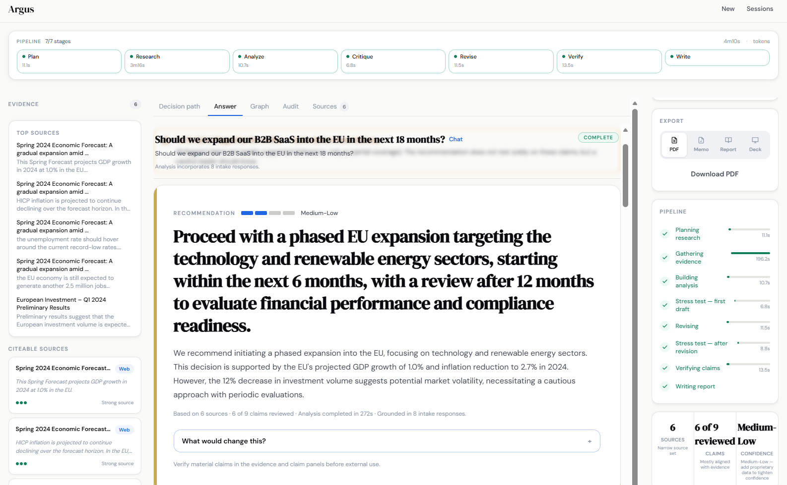
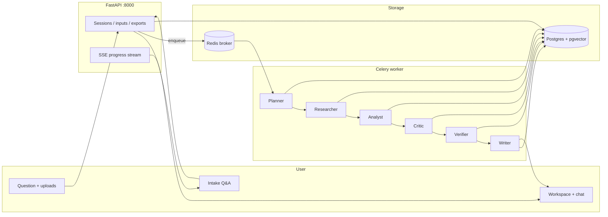

# Argus — Evidence-Grounded AI Decision Engine

A full-stack AI system for turning messy strategic questions, uploaded documents, and web evidence into verified client-ready reports with citations, confidence, caveats, and exportable deliverables.


---

## Demo

- **Live demo:** _<link — coming soon>_
- **3-minute walkthrough:** _<Loom link — coming soon>_
- **Example use case:** *"Should a SaaS company enter Germany or France first?"*
- **Full case study:** [`docs/case-studies/germany-vs-france/`](docs/case-studies/germany-vs-france/)

> Want to try it without an API key? Run `make demo` and Argus boots with a pre-seeded workspace and finished example report. See **Quickstart** below.



---

## The problem

Generic chatbots produce fluent prose that sounds confident while quietly mixing inference with facts and citing nothing you can audit. Consultants are slow and expensive. Spreadsheets and decks don't synthesize across documents and the open web — search gives fragments, chat gives opinions.

Argus produces a **defensible recommendation**: traceable evidence, explicit confidence, surfaced caveats, and exportable deliverables a client can take to a meeting.

---

## Example use case

**Question:** *"Should a SaaS company enter Germany or France first?"*

**What Argus does:**
1. Generates a focused intake (target ICP, horizon, headcount, compliance posture)
2. Plans a research agenda (market, competition, regulation)
3. Pulls evidence from uploaded documents + the web
4. Synthesizes a recommendation, has a critic challenge it, then revises
5. Verifier checks every claim against the evidence catalog
6. Writer produces a consulting-grade memo with confidence levels and caveats
7. Exports as PDF, memo, or PPTX

**What you get:** a recommendation with every claim linked back to a real source, a trust rail showing verifier verdicts, and a deliverable formatted for a client meeting.

→ Full case study with prompt, evidence, final report, verifier output, and screenshots: [`docs/case-studies/germany-vs-france/`](docs/case-studies/germany-vs-france/)

---

## Architecture



| Layer | Tech |
|-------|------|
| Frontend | **Next.js 14** (App Router), Tailwind, TypeScript |
| API | **FastAPI** (Python 3.11+), async, slowapi rate limiting |
| Worker | **Celery 5.3** + **Redis 7** (broker + result store) |
| Database | **PostgreSQL 15** + **pgvector** (1536-dim embeddings) |
| AI Pipeline | Planner → Researcher → Analyst → Critic → Verifier → Writer |
| LLM | OpenAI (gpt-4o, gpt-4o-mini); optional SerpAPI, Cohere rerank |
| Exports | **PDF** (WeasyPrint), **PPTX** (python-pptx), memo, structured JSON |

Deep architecture: [`docs/architecture.md`](docs/architecture.md).

---

## Features

| Feature | What it does |
|---------|--------------|
| **Client workspace** | Three-column workspace (evidence · answer · trust) framed as a client deliverable |
| **Document upload + retrieval** | PDF/HTML ingest, pgvector embeddings, hybrid lexical + vector retrieval, optional Cohere rerank |
| **Evidence graph** | Visual claim → evidence → source → verdict graph (react-flow), color-coded by verifier verdict |
| **Verifier agent** | Every analyst claim re-checked against the evidence catalog; verdicts (supported / weak / unsupported / overstates) surfaced inline |
| **Confidence + caveat panel** | Trust rail with confidence label, contradiction-capped score, unsupported-claim count, caveats |
| **PDF / memo / deck export** | WeasyPrint PDF, structured memo, PPTX deck — all content-hash cached |
| **SSE progress** | Live agent-by-agent progress with timestamps, durations, and token counters |
| **One-command run** | `make demo` brings up the whole stack with a seeded example workspace |
| **Deterministic demo mode** | `DEMO_MODE=1` runs end-to-end with no API key required, using fixture-backed agent outputs |

---

## Quickstart

### One-command demo (no API key required)

```bash
git clone https://github.com/yassin1123/Argus.git
cd Argus
make demo
```

Open [http://localhost:3000](http://localhost:3000). The homepage will already have three seeded demo engagements you can click into immediately.

### Full mode (with your own API key)

```bash
cp .env.example .env
# Set OPENAI_API_KEY in .env

docker compose up --build
```

Frontend (second terminal):
```bash
cd frontend
cp ../.env.example .env.local   # NEXT_PUBLIC_API_URL=http://localhost:8000
npm install && npm run dev
```

Open [http://localhost:3000](http://localhost:3000). Health check: [http://localhost:8000/api/health](http://localhost:8000/api/health).

> First Postgres init applies SQL in `backend/db/migrations/` (`001` … `010`). Reusing an old volume? See [`ZIP_PACKAGE.md` §5](ZIP_PACKAGE.md).

Optional smoke check after Compose is up:
```bash
bash tools/smoke_check.sh
```

---

## The pipeline

| Agent | Responsibility | Output |
|-------|----------------|--------|
| **Planner** | Breaks the strategic question into 4–8 research tasks with decision criteria and scope | `tasks[]`, `decision_criteria[]`, `scope` |
| **Researcher** | Executes tasks in parallel; pulls from documents and the web; deduplicates and triages | `EvidenceObject[]` (UUID, quote, source, confidence, is_inference) |
| **Analyst** | Synthesizes ≥6 key claims, each tied to evidence UUIDs; produces recommendation, trade-offs, assumptions | `key_claims[]`, `recommendation`, `trade_offs`, `assumptions` |
| **Critic** | Challenges the analysis; flags weak points; issues revision instructions with severity | `verdict`, `revision_instructions[]` |
| **Analyst (revision)** | Applies critic feedback; re-synthesizes | revised `key_claims[]` |
| **Verifier** | Re-checks every claim against the evidence catalog | `claim_assessments[]` (verdict + evidence_ids + notes) |
| **Writer** | Produces final consulting-grade report; **must** link `executive_insights`, `recommendation_claim_ids`, `key_risks_structured` to analyst claim_ids (enforced) | `WriterReportPayload` |

**Evidence gates** ensure every key claim cites a real persisted evidence object — strict mode bans inference-only support. **Contradiction policy** caps confidence when sources disagree.

---

## Engineering quality

- **Deterministic demo mode** — `DEMO_MODE=1` boots the stack with seeded sessions and fixture-backed agent outputs. No API key required to evaluate.
- **Normalized evidence graph schema** with unit tests covering claim ↔ evidence ↔ source mapping.
- **Verifier outputs persisted per claim** in `claim_support_rows`, surfaced in the UI with verdicts and entailment scores.
- **Strict evidence gates** — analyst claims must cite catalog UUIDs; writer must link insights to claim_ids; both enforced and tested.
- **Dockerized local environment** — one command runs Postgres+pgvector, Redis, FastAPI, Celery worker, and the Next.js dev server.
- **CI checks** for backend tests, type checks, frontend build, and a Docker Compose demo smoke test.
- **Full sample case study** included: prompt → evidence → report → verification → exported deliverable.

---

## Why this matters for deployment

Argus is built around the realities of forward-deployed AI work: ambiguous client problems, messy evidence, the need for auditable reasoning, fast iteration, and a polished deliverable a client can actually take to a meeting. The architecture treats *separation of claims from evidence*, *verification passes*, and *exportable artifacts* as first-class concerns — not as bolt-ons.

For the bridge between this portfolio demo and a real engagement — multi-tenancy, auth, audit log, eval set, tracing, cost transparency, and what I'd *deliberately defer* — see [`docs/day-one.md`](docs/day-one.md).

---

## API surface

| Method | Path | Purpose |
|--------|------|---------|
| `POST` | `/api/sessions` | Create a draft session |
| `POST` | `/api/sessions/{id}/intake/generate` | Generate clarifying intake questions |
| `POST` | `/api/sessions/{id}/intake/submit` | Submit intake answers |
| `POST` | `/api/sessions/{id}/run` | Enqueue the pipeline |
| `GET` | `/api/workspaces/{id}` | Session detail + presentation labels (primary UI feed) |
| `GET` | `/api/workspaces/{id}/events` | SSE progress stream |
| `GET` | `/api/workspaces/{id}/graph` | Normalized evidence graph (claims ↔ evidence ↔ sources) |
| `GET` `POST` | `/api/sessions/{id}/chat` | Conversational follow-ups |
| `POST` | `/api/inputs/upload` · `/api/inputs/url` | Document ingest |
| `GET` | `/api/exports/pdf\|memo\|report\|pptx/{id}` | Deliverables (content-hash cached) |

---

## Tests

```bash
make test
# or:
cd backend && pip install -r requirements.txt && pytest tests -q
```

CI runs the same suite plus a Docker Compose demo smoke test on every push.

---

## Repository layout

| Path | What lives there |
|------|------------------|
| [`backend/api/`](backend/api/) | HTTP routers (sessions, workspaces, chat, inputs, exports, evaluations, reports) |
| [`backend/agents/`](backend/agents/) | Pipeline agents — `orchestrator.py` is the entry point |
| [`backend/core/`](backend/core/) | Evidence gates, retrieval, verification, contradiction policy, trust labels |
| [`backend/db/migrations/`](backend/db/migrations/) | SQL migrations (`001` … `011`) |
| [`backend/deliverables/`](backend/deliverables/) | PDF / PPTX / memo rendering |
| [`backend/tests/`](backend/tests/) | pytest suite + fixtures (shared with `DEMO_MODE`) |
| [`frontend/app/`](frontend/app/) | Next.js App Router pages |
| [`frontend/components/`](frontend/components/) | Workspace, report, evidence graph, trust rail components |
| [`docs/case-studies/`](docs/case-studies/) | Worked examples with full inputs, outputs, and deliverables |
| [`docs/architecture.md`](docs/architecture.md) | Deep architecture diagrams + data flow |
| [`tools/`](tools/) | Build, smoke check, e2e scripts |

For commands and curl samples, also see [`ZIP_PACKAGE.md`](ZIP_PACKAGE.md). For codebase change-points, [`CODEBASE_OVERVIEW.md`](CODEBASE_OVERVIEW.md).
