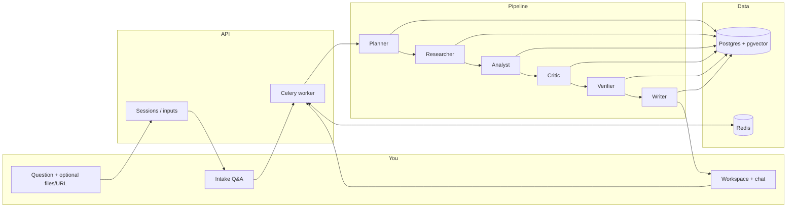

# Argus

## 1. What Argus is

**Argus** is an evidence-grounded decision engine. You ask a strategic question; it gathers context from your uploads and optional web research, runs a **multi-agent pipeline** (plan → research → analyze → challenge → verify → write), and returns a **structured report**: clear recommendation, explicit claims tied to sources, confidence and caveats, and exports (PDF, memo, deck). A short **intake** step captures your constraints so the plan matches how *you* frame the decision—not a generic chat reply.

---

## 2. The problem

Most “AI for decisions” tools optimize for **fluent prose**, not **accountability**. A single model pass can sound confident while omitting tradeoffs, mixing inference with facts, or citing nothing you can audit. Spreadsheets and slide decks don’t fail loudly—they just don’t **synthesize** across documents and the open web. Search gives fragments; chat gives opinions. Neither reliably produces a **defensible recommendation** with **traceable evidence** and **explicit uncertainty**.

---

## 3. The insight

There is a gap between **thinking** (framing, prioritizing, challenging) and **execution** (retrieval, citation, consistency checks). Argus splits the work: specialized agents handle execution under shared rules, while the product flow (intake + workspace + trust rail) keeps the human’s intent in the loop. The goal isn’t more text—it’s **separation of claims from evidence**, **verification passes**, and **artifacts** you can share or revisit without exposing raw IDs and internal noise in the UI.

---

## 4. How it works



High level: a session is created as **draft** → intake saves answers to the DB → **run** enqueues the pipeline on the worker → the UI polls **`GET /api/workspaces/{id}`** and may use **SSE** for live progress → a **report** row and **evidence** graph back the answer surface. Follow-up **chat** can append context and trigger another run when needed.

---

## 5. Example output

*Illustrative shape of a completed report (wording varies by question and evidence).*

**Recommendation (excerpt)**  
Proceed with a **limited pilot** in Germany before committing build-out in France, contingent on two diligence gates: confirmed unit economics in one reference vertical and signed pathway to local compliance for your data stack.

**Key reasons**

- Three independent sources support stronger B2B SaaS density and procurement cycles in the German target segment you named.  
- France shows higher upside in your long-range scenario but with thinner near-term evidence in the uploaded set.  
- Intake constraints (18-month horizon, fixed headcount) favor a **sequenced** entry over parallel country bets.

**Risks & caveats**

- Web-sourced material may lag filings; treat regulatory notes as **directional** until counsel reviews.  
- Two claims rest on **partial** document coverage—see trust panel for verifier labels.

**Next steps**  
Time-bound: (1) run the pilot KPI sheet, (2) book compliance review, (3) freeze scope for France until gate (1) is green.

---

## 6. Tech stack

| Layer | Choice |
|--------|--------|
| API | Python 3.11+, **FastAPI** |
| Jobs | **Celery** + **Redis** |
| Database | **PostgreSQL** + **pgvector** |
| Frontend | **Next.js 14** (App Router), **Tailwind** |
| LLMs | **OpenAI** (required); optional **SerpAPI**, **Cohere** |
| Exports | **WeasyPrint** (PDF), python-pptx (deck) — API runs in **Docker** on Windows |

---

## Clone from GitHub

```bash
git clone https://github.com/yassin1123/Argus.git
cd Argus
```

Then follow **Run it locally** (copy `.env.example` to `.env` and `frontend/.env.local` — do not commit API keys).

---

## Run it locally

**Prerequisites:** Docker Desktop, Node.js 20+, an `OPENAI_API_KEY`.

```bash
cp .env.example .env
# Set OPENAI_API_KEY in .env

docker compose up --build
```

Second terminal:

```bash
cd frontend
cp ../.env.example .env.local
# NEXT_PUBLIC_API_URL=http://localhost:8000

npm install
npm run dev
```

Open [http://localhost:3000](http://localhost:3000). Health check: [http://localhost:8000/api/health](http://localhost:8000/api/health).

On **first** Postgres init, SQL in `backend/db/migrations/` applies in order (`001` … `010`). Reusing an **old** Docker volume may require running newer migration files manually—see **`ZIP_PACKAGE.md` §5**.

**Optional:** after Compose is up, `bash tools/smoke_check.sh` checks Redis, API health, and the Celery worker.

---

## Distribution & docs

| File | Use |
|------|-----|
| **`START_HERE.txt`** | Fast pointer after unzipping |
| **`ZIP_PACKAGE.md`** | Full runbook, API list, migrations, troubleshooting |
| **`CODEBASE_OVERVIEW.md`** | Repo layout and where to change behavior |
| **`ARCHIVE.txt`** | One-page manifest |

Rebuild **`argus.zip`**: `python tools/package_argus_zip.py`

---

## API sketch

- `POST /api/sessions` — create draft  
- `POST /api/sessions/{id}/intake/generate` · `…/submit` — intake  
- `POST /api/sessions/{id}/run` — enqueue pipeline  
- `GET /api/workspaces/{id}` — session + `presentation` labels (primary for UI)  
- `GET /api/workspaces/{id}/events` — SSE progress  
- `GET|POST /api/sessions/{id}/chat` — follow-up chat  
- `GET /api/exports/pdf|memo|report|pptx/{id}` — deliverables when complete  

---

## Tests

```bash
cd backend
pip install -r requirements.txt
pytest tests -q
```

**Note:** WeasyPrint is easiest inside Docker. Optional web search: set `SERPAPI_KEY` in `.env`. Re-running after **failed**, **insufficient**, or **complete** clears prior pipeline artifacts for that session before a new run.
