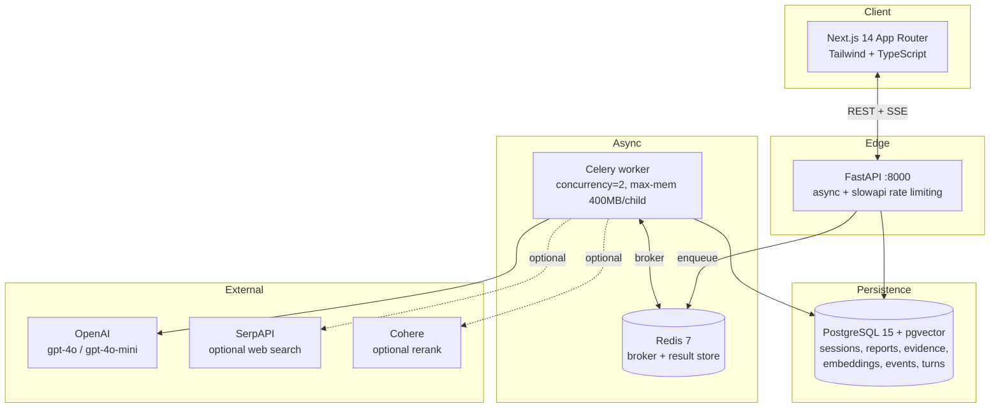
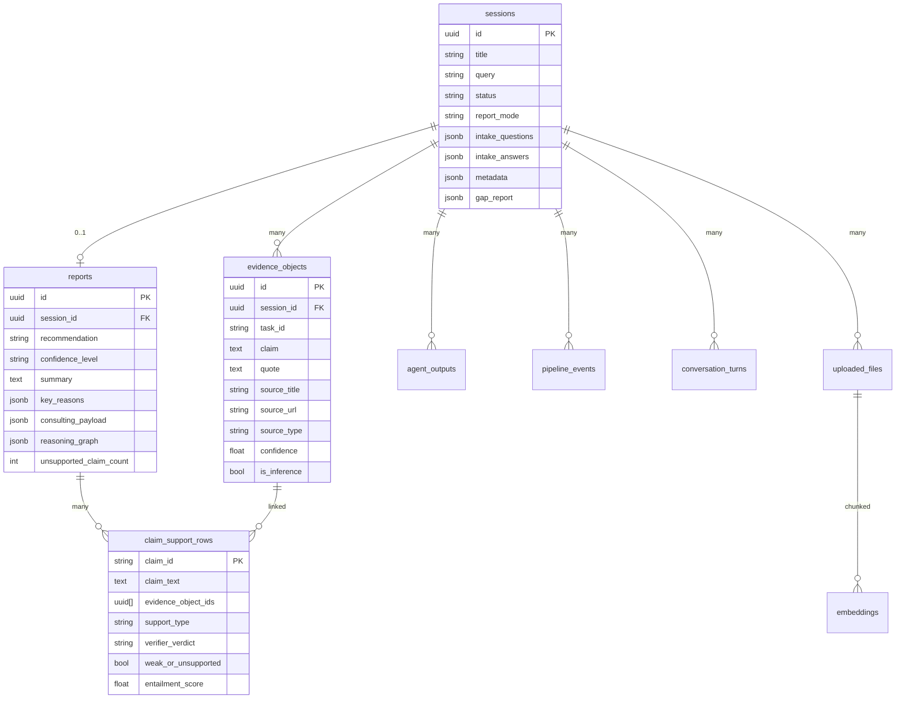
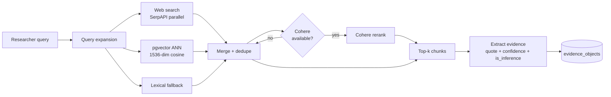
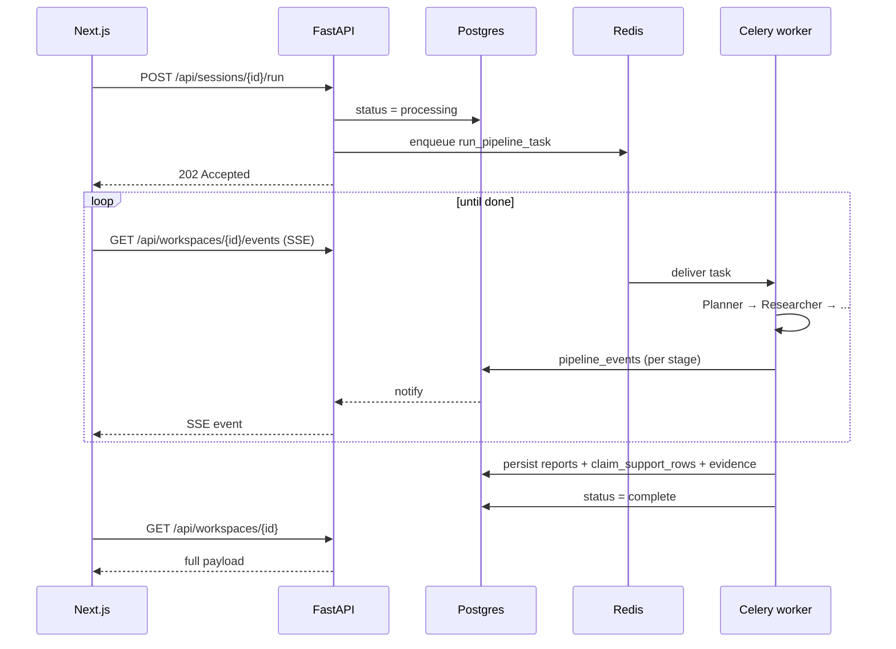

# Argus — Architecture Deep Dive

This document is for engineers reviewing the codebase. The top-level [`README.md`](../README.md) is the public-facing pitch; this is the technical map.

---

## 1. System topology



**Memory budget:** worker capped at 1500MB total, 400MB per child; backend at 768MB. Sized to run on a developer laptop alongside Postgres and Redis.

---

## 2. Pipeline DAG

```mermaid
flowchart LR
  start([run_pipeline]) --> P[Planner]
  P --> R[Researcher<br/>parallel branches]
  R -->|EvidenceObject[]| A[Analyst<br/>≥6 key_claims]
  A --> Cr[Critic<br/>verdict + revisions]
  Cr -->|accept| V[Verifier]
  Cr -->|revise| A2[Analyst revision]
  A2 --> V
  V --> EG{Evidence<br/>gates pass?}
  EG -->|yes| Wr[Writer]
  EG -->|no| reject([insufficient])
  Wr --> done([report persisted])
```

**Stages persist as `agent_outputs` rows** keyed by `(session_id, agent_name)` with input preview, full output JSON, duration, and token usage.

**Stages emit `pipeline_events` rows** consumed by the SSE stream — `event_type ∈ {trace, complete, error}`, `stage`, `status`, `payload` JSONB, timestamp.

---

## 3. Data model



---

## 4. Evidence accountability — the core invariant

Every claim must be traceable. The system enforces this in four places:

| Gate | Where | What it checks |
|------|-------|----------------|
| **Analyst gate** | `backend/core/evidence_gates.py` | `key_claims[].evidence_ids` reference real persisted `evidence_objects.id`s. Strict mode (`ARGUS_STRICT_NO_INFERENCE_ONLY=1`) bans claims supported only by `is_inference=true` evidence. |
| **Verifier validation** | `backend/core/verification_validate.py` | Verifier output covers all claims; assessments are usable; no orphan ids. |
| **Writer linkage** | `validate_writer_claim_linkage()` | `executive_insights[].claim_id`, `recommendation_claim_ids`, `key_risks_structured[].claim_id` must all map to analyst `claim_id`s. Strict mode (`ARGUS_STRICT_WRITER_CLAIM_IDS=1`) hard-fails if not. |
| **Contradiction policy** | `backend/core/contradiction_policy.py` | When research turns up tensions, confidence is capped and a caveat is auto-appended. Min-tensions threshold configurable via `ARGUS_CONTRADICTION_FORCE_REVISION_MIN`. |

**Net effect:** the UI's trust rail (`unsupported_claims_count`, `verification_overall_label`, `confidence_label`) is computed from real verifier output, not vibes.

---

## 5. Retrieval



- **Embeddings** are OpenAI `text-embedding-3-small` (1536-dim), persisted in pgvector.
- **Chunker** (`backend/core/chunker.py`) preserves page numbers and section hints for citation.
- **Web fetch** is gated by `WEB_FETCH_ALLOWED_DOMAINS` / `WEB_FETCH_BLOCKED_DOMAINS`.
- **Research v2** (`ARGUS_RESEARCH_V2=1`) adds preferred-domain score boosting and URL-based deduplication.

---

## 6. Async pipeline



**Failure modes:**
- LLM timeout → fallback model retry (configured per task in `backend/config/models.yaml`)
- JSON parse fail → `backend/core/inference/repair.py` attempts repair, then re-prompts
- Pipeline error → `pipeline_events` row with `event_type=error`, session marked `failed`
- Re-run on a `failed` / `complete` / `insufficient` session clears prior artifacts before re-enqueuing (idempotent)

---

## 7. Frontend data flow

```mermaid
flowchart TB
  page[/sessions/[id]/page.tsx/] --> swr[useSWR poll 3s]
  page --> sse[EventSource SSE]
  swr --> api1[GET /api/workspaces/{id}]
  sse --> api2[GET /api/workspaces/{id}/events]
  api1 --> dto[WorkspacePresentation DTO]
  dto --> rail1[EvidenceRail]
  dto --> canvas[AnswerCanvas]
  dto --> rail2[TrustRail]
  dto --> graph[EvidenceGraph]
  dto --> audit[AuditPanel]
```

**Presentation DTOs** (`backend/models/workspace_dto.py`) decouple raw DB shape from UI labels — confidence labels, verification summaries, and caveats are computed server-side and shipped pre-formatted.

---

## 8. Configuration

| Concern | File / env |
|---------|-----------|
| Model routing | `backend/config/models.yaml` + `ARGUS_MODEL_<TASK>` env overrides |
| Temperature / tokens | `ARGUS_TEMP_<TASK>`, `ARGUS_MAX_TOKENS_<TASK>` |
| Consulting modes | `backend/config/consulting_modes.yaml` |
| Reasoning skeletons | `backend/config/reasoning_skeletons.yaml` (override path via `ARGUS_REASONING_SKELETONS_PATH`) |
| Strict gates | `ARGUS_STRICT_NO_INFERENCE_ONLY=1`, `ARGUS_STRICT_WRITER_CLAIM_IDS=1` |
| Demo mode | `DEMO_MODE=1` (boots without LLM keys; serves fixture-backed responses) |

---

## 9. Where to make changes

| Goal | Start here |
|------|------------|
| Change a prompt | `backend/agents/*.py` (look for `SYSTEM_PROMPT`) |
| Swap a model | `backend/config/models.yaml` or `ARGUS_MODEL_<TASK>` env |
| Add an API route | `backend/api/*.py` + register in `backend/main.py` |
| Add a DB table | `backend/db/migrations/NNN_*.sql` + extend `backend/db/queries.py` |
| Modify trust rail | `backend/models/workspace_dto.py` + `frontend/components/sessions/TrustRail.tsx` |
| Change export format | `backend/deliverables/` |
| Tweak retrieval | `backend/core/retrieval.py`, `backend/core/web_search.py` |
| Add a graph view feature | `backend/models/reasoning.py` + `frontend/components/Report/EvidenceGraph.tsx` |

---

## 10. Tests + CI

- Backend tests live in `backend/tests/`. Run with `make test` or `pytest tests -q`.
- Fixtures in `backend/tests/fixtures/` are reused by `DEMO_MODE` so tests and the no-key demo share one source of truth.
- CI runs lint + type check + pytest + a Docker Compose smoke test on every push (`.github/workflows/ci.yml`).
