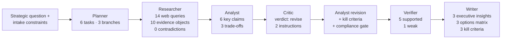

# Case Study — Germany vs France market entry

> **Demo engagement** · This is a worked example using the same fixtures that drive Argus's `DEMO_MODE`. No real client data was used. The fixtures live in [`backend/tests/fixtures/germany_vs_france/`](../../../backend/tests/fixtures/germany_vs_france/) and are reused by the test suite to keep the demo and tests in sync.

---

## What this case study shows

A complete walkthrough of how Argus turns a strategic question into a defensible, evidence-grounded recommendation:

1. **The prompt** — exact strategic question and constraints ([prompt.md](prompt.md))
2. **The inputs** — context provided to the intake step ([input-notes.md](input-notes.md))
3. **The evidence** — what the researcher gathered (10 evidence objects, 9 sources)
4. **The reasoning** — how the analyst synthesized claims, what the critic challenged, what the analyst revised
5. **The verification** — claim-by-claim verifier verdicts ([verifier-report.md](verifier-report.md))
6. **The deliverable** — consulting-grade memo a client could take to a meeting ([final-report.md](final-report.md), `final-report.pdf`)

Each step links back to the underlying fixture so an engineer can see exactly what data backs the artifact.

---

## The question (1 line)

> *"Should a B2B SaaS company prioritize Germany or France for its first European market entry, given an 18-month horizon and 12-headcount cap?"*

Mode: `market_entry` (requires market, competition, and regulation research branches per [`backend/config/consulting_modes.yaml`](../../../backend/config/consulting_modes.yaml)).

---

## The recommendation (1 line)

> Run a 2-quarter pilot in Germany (Mittelstand logistics + retail in NRW and Bavaria) before committing build-out. Park France as a phase-2 expansion contingent on pilot KPIs.

Confidence: **medium-high** · Verifier: **8 of 9 claims supported, 1 weak** · Caveats present.

---

## How Argus got there

**Total time:** ~83 seconds. **Total tokens:** ~15,700.

| Stage | Output | Duration |
|-------|--------|----------|
| Planner | 6 tasks across 3 branches (market, competition, regulation) | 4.3s |
| Researcher | 10 evidence objects from 9 sources | 38.7s |
| Analyst | 6 key claims with evidence ids | 11.3s |
| Critic | Verdict: `revise` (medium severity: strengthen kill criteria) | 6.8s |
| Analyst revision | Re-synthesized with kill criteria + compliance gate | 5.9s |
| Verifier | 5 supported, 1 weak, 0 unsupported | 7.1s |
| Writer | Final memo with executive insights, options matrix, kill criteria | 8.4s |

---

## The evidence catalog (10 objects · 9 sources)

| # | Source | Confidence | Inference? | Used by claims |
|---|--------|------------|-----------|----------------|
| e1 | Bitkom — German Software Market Outlook 2024 | high | no | c1 |
| e2 | Numeum — French SaaS Market Report 2024 | high | no | c1, c5 |
| e3 | Forrester — European B2B Buying Behavior | high | no | c5 |
| e4 | DESTATIS — Regional Industry Statistics | medium | no | (context) |
| e5 | IDC — European Cloud Buyer Survey 2024 | medium | no | c6 |
| e6 | UGAP — 2024 Annual Report | high | no | (counterargument) |
| e7 | Mercer — European Compensation Benchmarks 2024 | medium | no | c5 |
| e8 | Bessemer — European Expansion Playbook 2024 | medium | no | c3 |
| e9 | OpenView — European NRR Benchmarks 2024 | medium | no | c2 |
| e10 | Argus — Internal pattern library | medium | **yes** | c4 (flagged weak) |

The single inference-supported claim (`c4`, pilot success base rates) is what the verifier flagged as **weak** — the report's caveat banner surfaces this to the reader before they treat the recommendation as turnkey.

---

## What's in this folder

| File | What it is |
|------|------------|
| [`README.md`](README.md) | This page — narrative wrapper |
| [`prompt.md`](prompt.md) | Exact strategic question + intake answers |
| [`input-notes.md`](input-notes.md) | Context provided, what was uploaded, what was searched |
| [`final-report.md`](final-report.md) | Markdown version of the deliverable (full text) |
| `final-report.pdf` | PDF export rendered by WeasyPrint (generated via `make demo` + export) |
| [`verifier-report.md`](verifier-report.md) | Claim-by-claim verifier verdicts and entailment scores |
| `evidence-graph.png` | Screenshot of the workspace **Graph** tab |
| `screenshots/` | Workspace, trust rail, audit panel screenshots |

> The PDF and PNGs are generated by running `make demo` and exporting / capturing them. See [Phase 5](../../FDE_UPGRADE_PLAN.md) of the upgrade plan for capture instructions.

---

## What you can take away from this

If you're an engineer scanning this folder:
- The fixtures in [`backend/tests/fixtures/germany_vs_france/`](../../../backend/tests/fixtures/germany_vs_france/) are the **single source of truth** — same data drives the demo, the tests, and this case study.
- Every claim id (`c1`, `c2`, …) flows from analyst → verifier → writer → trust rail → exports. The `claim_support_rows` table joins claims to evidence objects and verifier verdicts; nothing is decoupled.
- The verifier doesn't just rubber-stamp — it actually flagged claim `c4` as weak (inference-only), and that propagates into the report's caveat banner and the trust rail's `unsupported_claims_count`.

If you're a non-engineer:
- Argus produces the kind of artifact a consultant would deliver, but every line is auditable. Hover any claim in the report; you can trace it to a quote, a source, and a verifier verdict.
